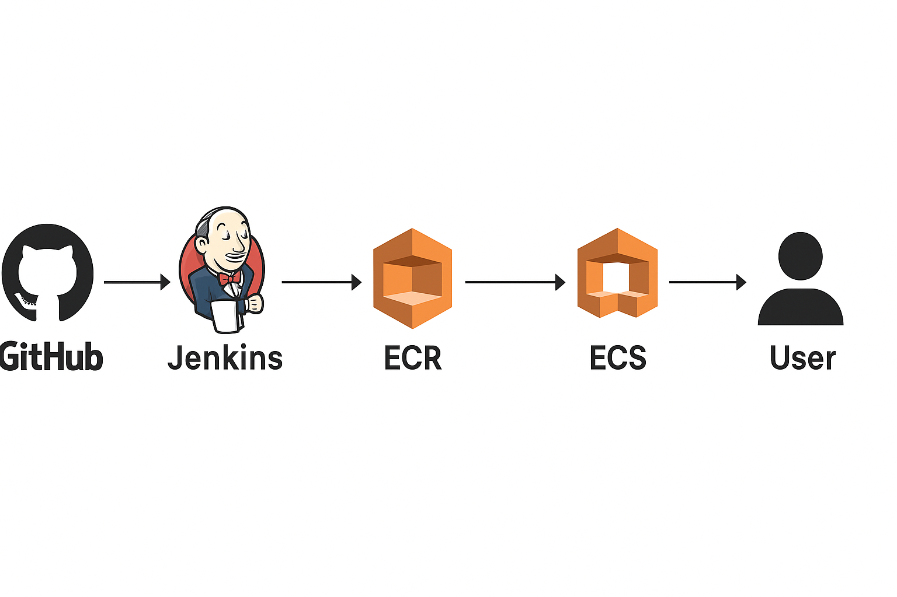

# Logo Server

A simple Express.js web server that serves the Swayatt logo image.

## What is this app?

This is a lightweight Node.js application built with Express.js that serves a single logo image (`logoswayatt.png`) when accessed through a web browser. When you visit the root URL, the server responds by displaying the Swayatt logo.

## Prerequisites

- Node.js (version 12 or higher)
- npm (Node Package Manager)

## Installation

1. Clone or download this repository
2. Navigate to the project directory:
   ```bash
   cd "devops task"
   ```
3. Install dependencies:
   ```bash
   npm install
   ```

## How to Start the App

Run the following command:
```bash
npm start
```

The server will start and display:
```
Server running on http://localhost:3000
```

## Usage

Once the server is running, open your web browser and navigate to:
```
http://localhost:3000
```

You will see the Swayatt logo displayed in your browser.

## Project Structure

```
├── app.js              # Main server file
├── package.json        # Project dependencies and scripts
├── logoswayatt.png     # Logo image file
└── README.md          # This file
```

## Technical Details

- **Framework**: Express.js
- **Port**: 3000
- **Endpoint**: GET `/` - serves the logo image
- **File served**: `logoswayatt.png`

## DevOps Setup -------------------------------

## 🚀 Project Overview
This project demonstrates a CI/CD pipeline for a sample Node.js application.  
The pipeline uses **GitHub → Jenkins → AWS ECR → AWS ECS (EC2 launch type)** to automate build, containerization, and deployment.



**Flow:**
1. Developer pushes code to GitHub (`dev` branch).
2. Jenkins is triggered via webhook.
3. Pipeline stages:
   - Install dependencies & run tests
   - Build Docker image
   - Push image to Amazon ECR
   - Deploy to Amazon ECS
4. ECS runs containerized application on EC2.

## ⚙️ Setup Instructions

### 1. Clone Repository
```bash
git clone https://github.com/<your-username>/devops-task.git
cd devops-task
run npm i
run npm start
#Check app will be running on http://localhost:3000
'''

### 2. Dockerisation of code

   1. Created feature branch for adding dockerfile
    
    git checkout -b feature/add-dockerfile
    
   2. Created Dockerfile and .dockerignore 
   3. Copy below Dockerfile 
   FROM node:18-alpine AS builder

   WORKDIR /app

   COPY package*.json ./

   RUN npm ci

   COPY . .

   FROM node:18-slim AS runner

   WORKDIR /app

   COPY package*.json ./

   RUN npm ci 

   COPY --from=builder /app . 

   EXPOSE 3000

   CMD ["npm", "start"]


   3. Create docker image from dockerfile and run container
    - docker build -t devops-task-image .
    - docker run -d -p 3000:3000 --name devops-task-container devops-task-image.

   4. Save dockerfile and .dockerignore file
    - git add Dockerfile .dockerignore
    - git commit -m "feat(docker): add multi-stage Dockerfile

   5. Push feature/dockerfile to dev and Merge it to dev


### 3. Creation of jenkins server

   1. Login AWS console and Create EC2 instace with 20 Gib gp2 volume 
   2. Create Security Group allow port 22(SSH) and 8080(Jenkins) only from my-ip for security.
   3. Connect to the Jenkins Instance after creation.
   4. Jenkins install configuration
   sudo apt update && sudo apt upgrade -y
sudo apt install -y openjdk-17-jdk curl unzip git

#Jenkins needs Java → OpenJDK 17 is stable
# Install Jenkins
curl -fsSL https://pkg.jenkins.io/debian/jenkins.io-2023.key | sudo tee \
  /usr/share/keyrings/jenkins-keyring.asc > /dev/null

echo deb [signed-by=/usr/share/keyrings/jenkins-keyring.asc] \
  https://pkg.jenkins.io/debian binary/ | sudo tee \
  /etc/apt/sources.list.d/jenkins.list > /dev/null

sudo apt update
sudo apt install -y jenkins

#  Start and enable service

sudo systemctl enable jenkins
sudo systemctl start jenkins

#install Docker
sudo apt install -y docker.io
sudo systemctl enable docker
sudo systemctl start docker

#add jenkins and ubuntu to docker group
sudo usermod -aG docker jenkins
sudo usermod -aG docker ubuntu

5. Configure Jenkins 
   
   - Access Jenkins UI: `http://<EC2-Public-IP>:8080`
   - Get initial admin password:
    
    ```bash
    sudo cat /var/lib/jenkins/secrets/initialAdminPassword
    
    ```
    
   - Install **suggested plugins**.
    - **Pipeline**
    - **GitHub** (for SCM)
    
    - **Docker Pipeline**
    - **Credentials Binding**
    - **Amazon ECR** (optional, but useful)

   -  Create an **Admin user**.

### 4. Start Building Pipeline (CI)

   1. Attach IAM role EC2 Jenkins-Server so that you don’t have hardcore your credentials.

   IAM policy:
   {
    "Version": "2012-10-17",
    "Statement": [
        {
            "Effect": "Allow",
            "Action": [
                "ecr:GetAuthorizationToken",
                "ecr:BatchCheckLayerAvailability",
                "ecr:CompleteLayerUpload",
                "ecr:InitiateLayerUpload",
                "ecr:PutImage",
                "ecr:UploadLayerPart",
                "ecr:BatchGetImage",
                "ecr:GetDownloadUrlForLayer",
                "ecr:DescribeRepositories",
                "ecr:ListImages",
                "ecs:RegisterTaskDefinition",
                "ecs:UpdateService",
                "ecs:DescribeServices",
                "ecs:DescribeTaskDefinition",
                "iam:PassRole"
            ],
            "Resource": [
                "*",
                "arn:aws:iam::390847198265:role/swayatt-ecsTaskExecutionRole"
            ]
        }
    ]
}


   2. Create ECR Repository
      name: swayatt-express-app

   3. First Create CI first. Create jenkins folder in root of your code. and inside jenkins create Jenkinsfile. 
   Paste below code.

```groovy
pipeline{
    agent any
    
    stages {
        stage('Checkout') {
            steps {
                git branch: 'main', url: 'https://github.com/Chauhandevansh/devops-task.git'
            }
        }
    
        stage('Install Dependencies & Run Tests') {
            steps {
                sh 'npm ci'
                sh 'echo "Code Testing"'
                sh 'echo "No tests defined"'
            }
        }
    
        stage('Build Docker Image') {
            steps {
                script {
                    sh """
                        aws ecr get-login-password --region ${AWS_REGION} \
                        | docker login --username AWS --password-stdin ${AWS_ACCOUNT_ID}.dkr.ecr.${AWS_REGION}.amazonaws.com/${ECR_REPO}

                        docker build -t ${AWS_ACCOUNT_ID}.dkr.ecr.${AWS_REGION}.amazonaws.com/${ECR_REPO}:${IMAGE_TAG} .
                    """
                }
            }
        }

        stage('Push to ECR') {
            steps {
                script {
                    sh "docker push ${AWS_ACCOUNT_ID}.dkr.ecr.${AWS_REGION}.amazonaws.com/${ECR_REPO}:${IMAGE_TAG}"
                }
            }
        }
     }
    post {
        success {
            echo 'Build succeeded 🎉'
        }
        failure {
            echo 'Build failed ❌'
        }
        unstable {
            echo 'Build unstable ⚠️'
        }   
        aborted {
            echo 'Build was aborted ⏹️'
        }
        always {
            cleanWs()   // cleanup in all cases
        }
    }

}
```

   4. Add Global Environment in Jenkins
      - Go to: **Manage Jenkins → System → Global properties → Environment variables**.
      - Add:
      AWS_REGION=ap-south-1
      AWS_ACCOUNT_ID=<Enter-Your-Account-ID>
      ECR_REPO=swayatt-express-app

   5. GitHub Webhook Setup
      - Go to your repo → **Settings → Webhooks → Add webhook**
      - Payload URL: `http://<jenkins-server-ip>:8080/github-webhook/`
      - Content type: `application/json`
      - Select: **Just push events**

   6. Create a Jenkins Job from Jenkins Dashboard for Pipeline
      - Add Item
      - Give project name and select pipeline
      - 

   7. Login to Jenkins Server (EC2)
      - Install Nodejs and npm
      - Install AWS CLI V2
      ```bash
      curl "https://awscli.amazonaws.com/awscli-exe-linux-x86_64.zip" -o "awscliv2.zip"
      unzip awscliv2.zip
      sudo ./aws/install
      ```

### 5. Create infra for CD
   1. Custom VPC
   - Create VPC with CIDR 10.0.0.0/20
   - Add Two subnet with CIDR 10.0.1.0/24 and 10.0.2.0/24
   - Create internet gateway and attach it VPC
   - Create One public route table. Add route to internet gateway and associate both subnet
   
   2. Create Auto Scaling Group (ASG)

   - Go to EC2 → Auto Scaling Groups → Create ASG.
   - Select the launch template ecs-launch-template.
   - Choose your VPC and 2 subnets.
   - Group size:
   - Desired capacity: 1 (start small).
   - Min capacity: 1.
   - Max capacity: 2 (so it can scale up if needed).
   - Scaling policies (optional for now, can add CPU-based scaling later).
   - Tags: Add Name = ECS-Cluster-Instance.
   - Create ASG.

   3. Launch ECS Cluster (EC2 launch type)
   - Go to ECS → Clusters → Create cluster.
   - Choose EC2 Linux + Networking.
   - Cluster settings:
   - Name: swayatt-cluster.
   - Infrastructure: Launch instances into your custom VPC + 2 subnets.
   - Choose EC2 instance type: t3.micro (cheapest for testing).
   - Select the IAM role you created for ECS.
   - Storage: default is fine.
   - Key pair: select one (for SSH access).

   4. Register Task Definition

   - ECS → Task Definitions → Create new.
   - Launch type: EC2.
   - Define container:
   - Image: 390847198265.dkr.ecr.ap-south-1.amazonaws.com/swayatt-express-app:latest.
   - Memory: 256 MiB.
   - CPU: 256.
   - Port mappings: 3000 → 3000 (or 80 if you want ALB).

   5. Create ECS Service

   - ECS → Services → Create.
   - Launch type: EC2.
   - Cluster: swayatt-cluster.
   - Task definition: your app task.
   - Desired tasks: 1 (for cost savings).
   - Deployment options:
      Without ALB 

# Infra for CD is created
### ADD CD Stage

   1. Add below groovy code to your pipeline jenkins/Jenkinfile
   '''groovy
   pipeline{
    agent any
    
    stages {
        stage('Checkout') {
            steps {
                git branch: 'main', url: 'https://github.com/Chauhandevansh/devops-task.git'
            }
        }
    
        stage('Install Dependencies & Run Tests') {
            steps {
                sh 'npm ci'
                sh 'echo "Code Testing"'
                sh 'echo "No tests defined"'
            }
        }
    
        stage('Build Docker Image') {
            steps {
                script {
                    sh """
                        aws ecr get-login-password --region ${AWS_REGION} \
                        | docker login --username AWS --password-stdin ${AWS_ACCOUNT_ID}.dkr.ecr.${AWS_REGION}.amazonaws.com/${ECR_REPO}

                        docker build -t ${AWS_ACCOUNT_ID}.dkr.ecr.${AWS_REGION}.amazonaws.com/${ECR_REPO}:${IMAGE_TAG} .
                    """
                }
            }
        }

        stage('Push to ECR') {
            steps {
                script {
                    sh "docker push ${AWS_ACCOUNT_ID}.dkr.ecr.${AWS_REGION}.amazonaws.com/${ECR_REPO}:${IMAGE_TAG}"
                }
            }
        }
        stage('Deploy to ECS') {
            steps {
                script {
                    sh '''
                        # Fetch current task definition
                        aws ecs describe-task-definition \
                            --task-definition ${TASK_FAMILY} \
                            --query taskDefinition \
                            --output json > taskdef.json

                        # Remove read-only fields
                        cat taskdef.json | jq 'del(
                          .status,
                          .revision,
                          .taskDefinitionArn,
                          .requiresAttributes,
                          .compatibilities,
                          .registeredAt,
                          .registeredBy
                        )' > new-task-def.json

                        # Register new revision (still uses :latest image)
                        aws ecs register-task-definition \
                            --cli-input-json file://new-task-def.json

                        # Update ECS service to pick the new revision
                        aws ecs update-service \
                            --cluster ${ECS_CLUSTER} \
                            --service ${ECS_SERVICE} \
                            --force-new-deployment
                    '''
                }
            }
        }
    }
    
        post {
            success {
                echo 'Build succeeded 🎉'
            }
            failure {
                echo 'Build failed ❌'
            }
            unstable {
                echo 'Build unstable ⚠️'
            }   
            aborted {
                echo 'Build was aborted ⏹️'
            }
            always {
                cleanWs()   // cleanup in all cases
            }
    }
}
''' 

   2. Add global environment variable
   Environment Variables Needed in Jenkins

      In Jenkins → Pipeline → Configure → Environment variables or Jenkinsfile:

         TASK_FAMILY (ECS task definition family name)

         ECS_CLUSTER (your ECS cluster name)

         ECS_SERVICE (your ECS service name)
   
   3. Build Your Pipeline